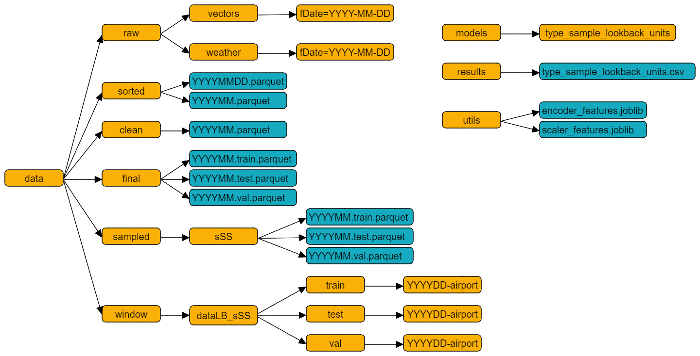

# File structure

- **data:** Contiene los conjuntos de datos en sus diferentes fases de procesamiento.
	- **raw:** Datos de vectores de estado e informes meteorológicos, almacenados por separado (directorios vectors y weeahter), y particionados por día. 
	- **sorted:** Ficheros parquet particionados a dos niveles:
		- Por día (`YYYYMMDD.parquet`): Es la salida del algoritmo de reordenación. Como es un proceso largo, se van guardando los resultados tras cada día.
		- Por mes (`YYYYMM.parquet`): Después, se consolidan en un único fichero por mes para alinearlo con el resto del proceso.
	- **clean:** Datos de vuelos tras aplicar el mecanismo de corrección de errores, particionados por mes.. 
	- **final:** Datos integrados de vuelos y meteorología, particionados por mes.
	- **sampled:** Datos finales tras aplicarles el proceso de downsampling, particionados por su finalidad (train, test, validation) y por mes. Para un periodo de muestreo SS, se almacenan en un directorio `sSS`.
	- **window:** Datasets de TensorFlow exportados a disco, con los ejemplos construidos para su uso con RNN (utilizando ventanas deslizantes).
- **models:** Contiene los checkpoints de los modelos entrenados. Cada carpeta se denomina de acuerdo al modelo que se está entrenando, combinando cuatro factores:
	- Tipo de modelo (ej. LSTM, LSTM-ED, GRU)
	- Período de muestreo de los datos (con la nomenclatura `sSS`)
	- Tamaño de la secuencia de entrada (con la nomenclatura `lbLB`)
	- Caracterización del modelo concreto (ej. por el número de unidades: `u10`)
	- Los modelos se guardan indicando la información de la época y los resultados de las métricas principales.
- **results:** Contiene los informes de la evaluación de los modelos, con una nomenclatura idéntica a la de los directorios de modelos.
- **utils**: Contiene los objetos serializados para la transformación de características categóricas a numéricas (`encoder_XX.joblib`) y el escalado de datos (`scaler_XX.joblib`). El número denota el número de características incluidas (un mecanismo simple para diferenciar entre diferentes conjuntos de características).
