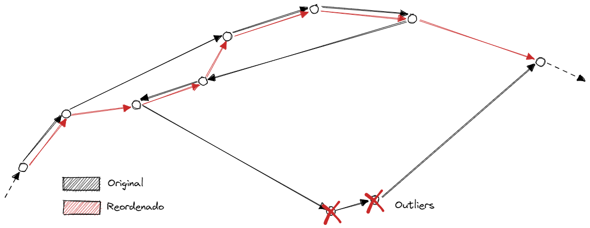

# Preprocessing notebook

En este cuaderno se lleva a cabo el preprocesamiento orientado a mejorar la calidad de las trayectorias, principalmente a través de dos operaciones:
- Reordenación de vectores: 
	- Los mensajes ADS-B reciben su marca de tiempo en el receptor, no se generan en el avión en el momento de su emisión. Por tanto, hay diferentes casos en los que el orden de recepción no coincide con el orden de emisión, dando la impresión, por ejemplo, de que el avión va dando saltos adelante y atrás.
	- También hay ocasiones en que largas rachas de mensajes llegan más tarde de lo que deberían, o tienen un timestamp incorrecto. Por ejemplo, debido a una mala configuración del reloj interno del sensor que los captura, una duplicación de datos mal resuelta, etc.
	- Para abordarlo, aplicamos una adaptación del Problema del Viajante (STP, *Travelling Salesman Problem*[^1]), que reordena los vectores (nodos) dentro de la secuencia (camino) para minimizar una función de distancia o de coste.

- Eliminación de outliers:
	- Al igual que en los timestamps, también podemos detectar defectos en algunas de las características de la trayectoria, principalmente su posición GPS (longitud, latitud, altitud), y hasta cierto punto en la velocidad (horizontal y vertical) o el *on_ground*. En algunos casos, es posible tomar acciones para recuperar estos vectores asignando un valor sintético, pero en otros únicamente podremos eliminarlo. 
	- En cualquiera de los casos, depende de tener una información temporal correcta.
- Si ni la posición ni el timestamp son del todo fiables, hay que partir de algunas hipótesis que asumimos como ciertas:
	- Eliminamos errores de posición flagrantes (por ejemplo, vectores geoposicionados en Turquía durante un vuelo París-Madrid), pero el resto son correctos de cara a la reordenación.
	- El timestamp y la posición de los primeros y últimos mensajes son correctos. De esta forma, sirven como "ancla" para reordenar el resto de vectores. En función del enfoque, estos vectores serán uno o dos en cada extremo de la trayectoria. 
	- Una vez "consolidada" la información temporal, podemos abordar el resto de dimensiones: posición, velocidad...

## Sort state vectors
(Implementado en [[RTAutils.sort_vectors]])

## Merge and fix data
(Implementado en [[RTAutils.data_cleaning]])

## Remove outliers
(Implementado en [[RTAutils.data_cleaning]])

---
[^1]: https://en.wikipedia.org/wiki/Travelling_salesman_problem